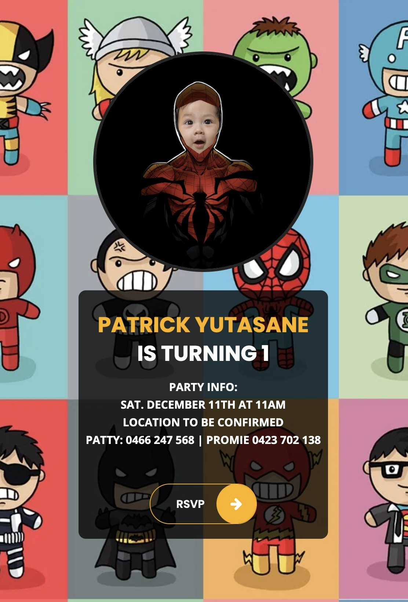

# Patrick
Patrick is a front-end application written in React and SASS to allow users to RSVP to Patrick's 1st birthday.

## Preview
**Desktop View**


**Mobile View**


## Requirements
- Node v14.18.1 LTS
- NPM 6.x

## Installation
```bash
npm install
```

## How to run
### Github Pages
This application is deployed to Github pages [https://promie.github.io/patrick/](https://promie.github.io/patrick/).

### Local
To run the application, run the below command in the root directory:
```bash
npm run start
```

A react application will spin up on `http://localhost:3000`

